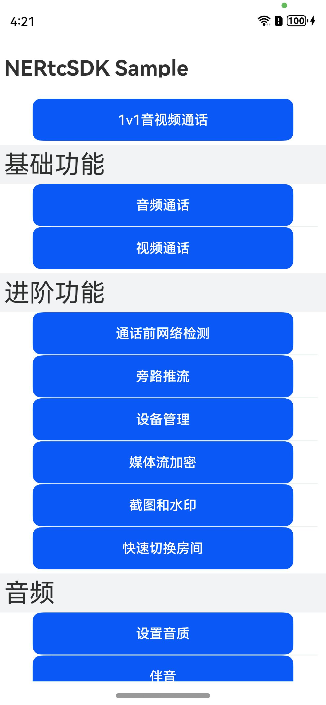

# 快速入门

本文介绍在鸿蒙平台下如何快速运行 NERtc DEMO 以及集成 NERtc SDK到项目中。

## 环境要求

- DevEco Studio 4.0 Release及以上。
- HarmonyOS SDK API 10 及以上。


## 版本运行依赖

注意：由于鸿蒙版本迭代比较快，且api的编译环境和运行环境比较依赖 ide 版本和鸿蒙系统版本。
请保持 NERtc SDK 的运行环境和下表环境保持一致。

| RTC版本 | API版本 | ide版本 | 鸿蒙系统版本   |
|  ----  | ----   | ----   |----------|
|0.1.0 | 10 | 4.0 | 2.0.0.33 |
|0.2.0 | 11 | 4.1.3.500 | 2.0.0.59 |
|0.3.0 | 11 | 4.1.3.600 | 2.0.0.66 |
 |1.0.0 -beta | 12 | 5.0.3.200 | 3.0.0.18 |


## 操作步骤

### 步骤1: 创建应用
创建应用并获取 AppKey，详情见链接：[点这里](https://doc.yunxin.163.com/console/docs/TIzMDE4NTA?platform=console)

### 步骤2: 配置AppKey

在应用配置中获取到AppKey配置到DEMO中。


### 步骤3: 编译运行

1.打开 RTC DEMO 配置签名：


2.连接真机，编译运行:


## 应用截图



## SDK 接入流程

### 线下集成

1. 拷贝 sdk.har 到项目文件夹中，例如： entry/src/main/libs

2. DEMO 工程下 oh-package.json5 配置 sdk.har 如下图所示：


3. 安装第三方包，点击 Run 'ohpm install'

### 依赖Openharmony仓库集成

1. Demo 工程下 oh-package.json5 配置

```json5
"dependencies": {
 "@nertc/nertc_sdk": "1.1.0-beta"
}
```

2. 点击 Run 'ohpm install'


调用SDK相关接口，完成入会流程

```typescript

//伪代码，具体实现参考 sample code

//从SDK中导入相关的interface或者class        
//如果是线下集成的: import { NERtcSDK } from 'sdk'
//依赖openharmony仓库集成的: import { NERtcSDK } from '@nertc/nertc_sdk' 
import { NERtcCallbackEx, NERtcConstants, NERtcSDK } from 'sdk';


//初始化引擎, 参数列表分别为: context: UIAbility Context 上下文对象,  appkey, SDK回调callback, 初始化参数option(可选).
NERtcSDK.getInstance().init(context, key, new ChatCallback(), option)
        
//入会：参数列表：鉴权token, 频道名，用户id
NERtcSDK.getInstance().joinChannel(join.token, join.cname, BigInt(join.uid))      

//离会：
NERtcSDK.getInstance().leaveChannel()        
        
//打开视频：
NERtcSDK.getInstance().enableLocalVideo(true)
        
//设置本地和远端画布
NERtcSDK.getInstance().setupLocalVideoCanvas(canvas)
NERtcSDK.getInstance().setupRemoteVideoCanvas(canvas, BigInt(setUp.uid))


```

## 运行DEMO
如果不想编译运行 `sample code`，可以解压 `ouput` 目录下 rtc_demo.zip 按照以下执行命令来安装到鸿蒙手机体验。

1.下载 rtc_demo hap包 [rtc_demo.zip](output%2Frtc_demo.zip)

2.将华为设备ID交与云信技术支持，将您的设备ID添加到云信后台白名单中

3.执行安装命令来安装hap包
```
hdc shell bm uninstall -n  com.netease.lava.nertc.demo
hdc file send "output/nertc_demo.hap" "data/local/tmp/nertc_demo.hap"
hdc shell bm install -p "data/local/tmp/nertc_demo.hap"
hdc shell rm -rf "data/local/tmp/nertc_demo.hap"
hdc shell aa start -a EntryAbility -b com.netease.lava.nertc.demo
```